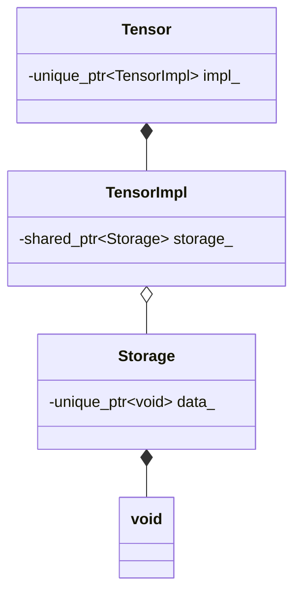

# ushionn 아키텍처

이 프로젝트의 핵심은 PyTorch나 TensorFlow와 같이 **동적 연산 그래프(Dynamic Computational Graph)**를 기반으로 동작하는 딥러닝 추론 및 학습 엔진을 밑바닥부터 C++와
CUDA로 구현하는 것입니다.

## 작동 방식

1. 저장된 모델과 가중치 파일을 읽어 각 가중치를 레이어로 바꾸어 저장(가중치 로드 X)
2. 레이어들을 노드로 하고 연산들을 엣지로 하여 연산 그래프를 제작
3. 연산 그래프를 바탕으로 연결되어있는 노드끼리 가까이 가중치를 배치
4. 입력이 정해지면 메모리 할당
5. 실행
6. 출력

실제 가중치를 3번에 로드할지 4번에 로드할지 고민중

## 각 핵심요소 설명

### 텐서

텐서는 다음과 같이 구성됌

## 노드

- 각 노드들끼리는 연산이 많아봤자 몇백번 수준일 것이기에 동적 다형성을 이용하여 구현
- 연산 자체를 정의하는 클래스도 동일한 논리로 동적 다형성을 이용하여 구현
