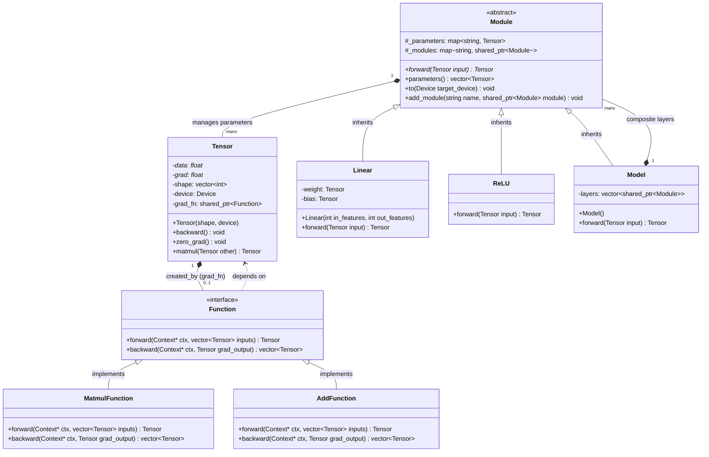

# UshioNN 아키텍처

## 디렉토리 구조

- core
- cuda
- layers
- model

## 모듈 역할

- core : 핵심 코어로 다른 모듈들에서 공통적으로 사용하는 코어 클래스 파일
- cuda : cuda를 이용하는 함수가 써진 cu파일들과 헤더들
- layers : 신경망의 레이어 클래스 파일들
- model : 신경망의 모델을 빌드할 때 쓰는 모델 클래스 파일

## 클래스 구조

